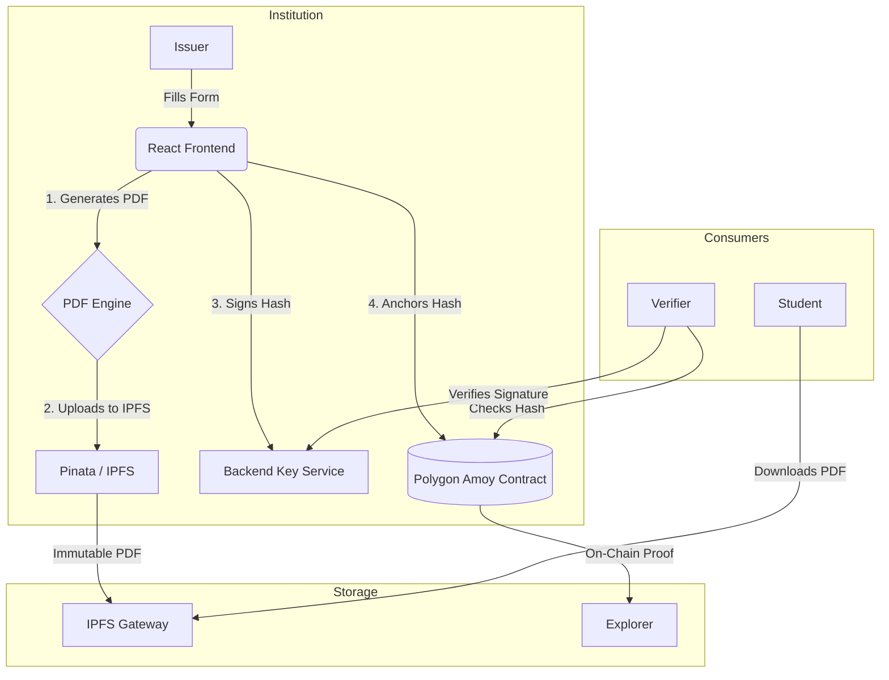

# MDM - Maritime Document Management Platform ⚓

[](https://opensource.org/licenses/MIT)
[](https://polygon.technology/)
[-65C2CB)](https://ipfs.tech/)
[](https://reactjs.org/)
[](https://github.com/mahendravelagapudi099-wq/MMD)

**MDM** is an enterprise-grade, decentralized platform for issuing, managing, and verifying maritime credentials. It solves the industry's reliance on paper documents by anchoring trust to the **Polygon Amoy Blockchain** and storing immutable records on **IPFS**.

> **Status:** Functionally Complete & Demo-Ready (v1.0)

---

## 🏛️ System Architecture

The ecosystem is composed of three distinct portals working in unison:

1. **Institution Portal (Issuer)**: For authorized maritime academies to issue and revoke certificates.
2. **Student Portal (Receiver)**: A personal wallet for students to view, share, and download their credentials.
3. **Verification Portal (Public)**: A zero-trust tool for port authorities and employers to validate claims instantly.

### 🛡️ The "Triple Lock" Trust Model

MDM employs a multi-layered security approach to guarantee authenticity:

1. **Blockchain Proof**: The existence and valid status of every certificate is recorded on the **Polygon Amoy** smart contract.
2. **Cryptographic Integrity**: The pure SHA-256 hash of the data effectively seals the content. Any alteration breaks the verification.
3. **Digital Signature (Side-Car)**: An off-chain RSA digital signature provides a secondary validation layer, linking the record directly to the issuer's server authority.

---

## 🔄 Data Flow



---

## ✨ Key Features

### 🎓 Institution Portal

- **Direct Issuance**: Issue secure certificates in seconds.
- **IPFS Storage**: Automatically uploads immutable PDFs to IPFS via Pinata.
- **Registry Management**: View and manage all issued certificates.
- **Smart Contract Security**: Only authorized Ethereum addresses can write to the registry.

### 🧑‍🎓 Student Portal

- **Personal Inventory**: Auto-fetches certificates linked to the student's email.
- **Immutable Downloads**: Downloads the *exact* original PDF from IPFS (no local regeneration).
- **Social Sharing**: One-click sharing to LinkedIn, WhatsApp, and Email.
- **Trust Badges**: Visual indicators of blockchain verification.

### ✅ Verification Portal

- **Instant Validation**: Verify by Certificate ID, Student ID, or QR Code.
- **Triple-Check**: Simulates hash recalculation, blockchain lookup, and signature verification.
- **Ledger Receipt**: Generates a detailed proof of verification for audit trails.
- **Public Access**: No login required for verifiers.

---

## 🛠️ Technology Stack

| Component | Technology | Purpose |
| :--- | :--- | :--- |
| **Frontend** | React 18, Vite, Tailwind CSS | Responsive, modern UI/UX |
| **Blockchain** | Polygon Amoy, Solidity, Hardhat | Decentralized trust anchor |
| **Storage** | IPFS (via Pinata) | Immutable document storage |
| **Backend** | Node.js, Express, OpenSSL | Digital signatures & Key management |
| **Database** | Firebase Firestore | Indexed metadata for fast queries |
| **Auth** | Firebase Auth | User management & Role-based access |

---

## 🚀 Getting Started

### 1. Prerequisites

- Node.js (v18+)
- MetaMask Wallet (Connected to Amoy Testnet)
- Git

### 2. Installation

```bash
# Clone the repository
git clone <repository-url>
cd MDM

# Install Backend Dependencies
npm install

# Install Frontend Dependencies
cd frontend
npm install
```

### 3. Configuration

1. Create a `.env` file in `frontend/` (see `.env.example`).
2. Set `VITE_NETWORK_MODE=amoy` for full blockchain features.

### 4. Running the Platform

```bash
# Terminal 1: Start Backend (Root)
node backend/server.js

# Terminal 2: Start Frontend
cd frontend
npm run dev
```

---

## 📄 License & Attribution

This project is open-source under the **MIT License**.
*Built for the Future of Maritime Operations.*
