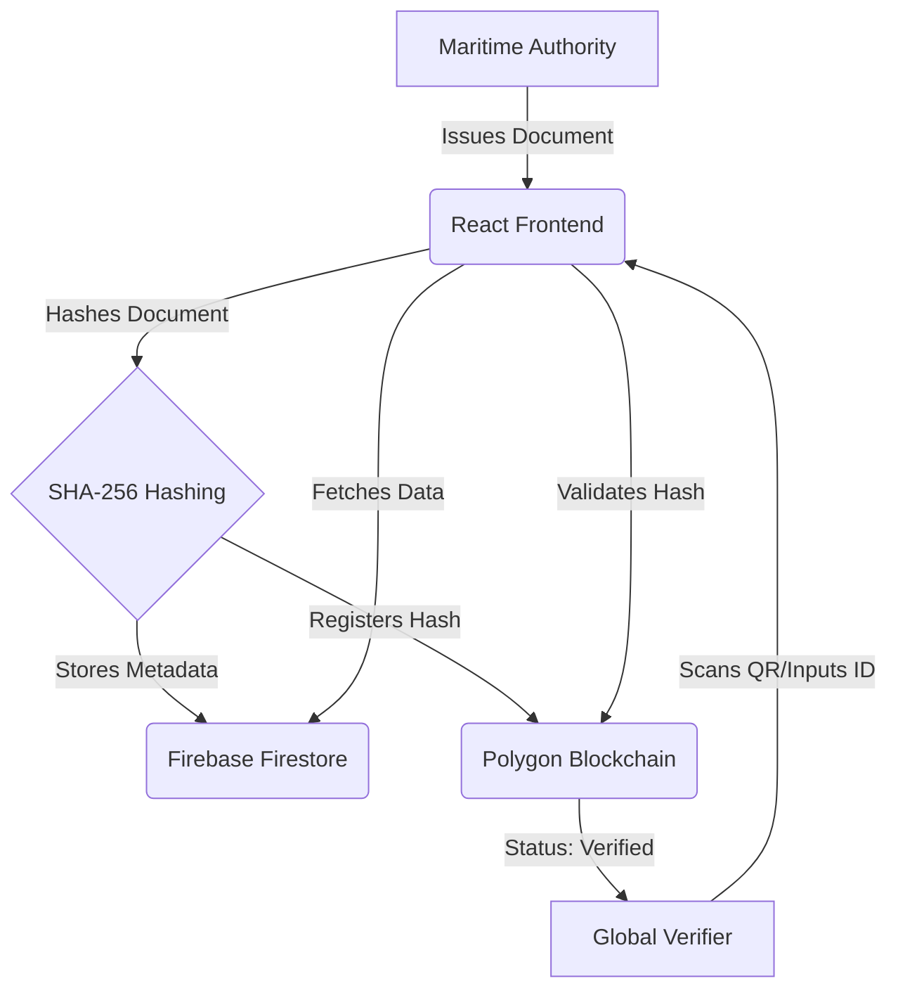

# MDM - Maritime Document Management 🚢

[](https://opensource.org/licenses/MIT)
[](https://polygon.technology/)
[](https://reactjs.org/)
[](https://firebase.google.com/)

**MDM** is a decentralized, blockchain-powered platform designed for the maritime industry to securely issue, manage, and verify crucial documents. By leveraging the Polygon blockchain, MDM ensures all maritime records are tamper-proof, immutable, and instantly verifiable globally.

---

## 🏗️ Architecture Overview

The system consists of a modern React frontend, a decentralized smart contract layer on Polygon, and a secure metadata management layer powered by Firebase.



## ✨ Key Features

- **Decentralized Trust**: Built on Polygon for institutional-grade security.
- **Instant Verification**: QR-code based instant verification for port authorities.
- **Immutable Records**: Once issued, documents cannot be altered or forged.
- **Professional Dashboard**: Intuitive interface for document issuers and administrators.
- **Global Accessibility**: Accessible from any corner of the globe for seamless maritime operations.

## 🛠️ Technology Stack

- **Frontend**: React 19, Vite, Tailwind CSS, Lucide Icons.
- **Blockchain**: Solidity, Hardhat, Ethers.js, Polygon Network.
- **Services**: Firebase (Authentication & Firestore).
- **Tools**: `html5-qrcode` for scanning, `jspdf` for document generation.

## 🚀 Getting Started

### 1. Prerequisites

- Node.js (v18+)
- MetaMask Browser Extension

### 2. Installation

```bash
git clone <repository-url>
cd MDM
npm install
cd frontend
npm install
```

### 3. Environment Setup

Create a `.env` file in the `frontend` directory based on `.env.example`.

### 4. Running Locally

```bash
# In the frontend directory
npm run dev
```

---

## 📄 Solution Details

For an in-depth look at how MDM solves maritime documentation challenges, differentiation from other solutions, and detailed architecture, please refer to our [SOLUTION.md](file:///d:/Desktop/MDM/SOLUTION.md).

---
*Empowering Maritime Trust through Blockchain.*
