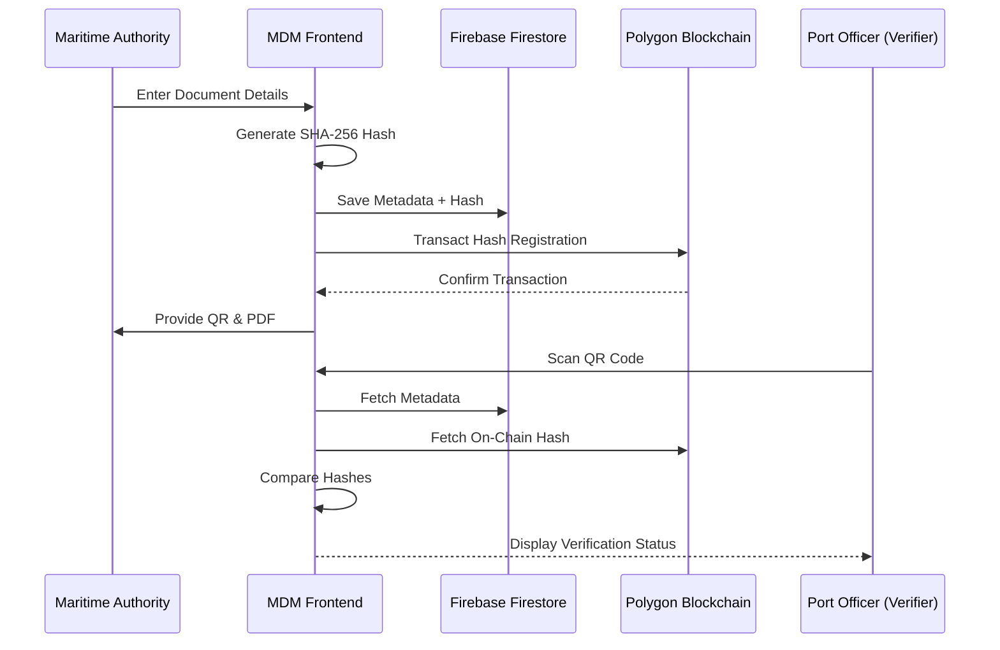
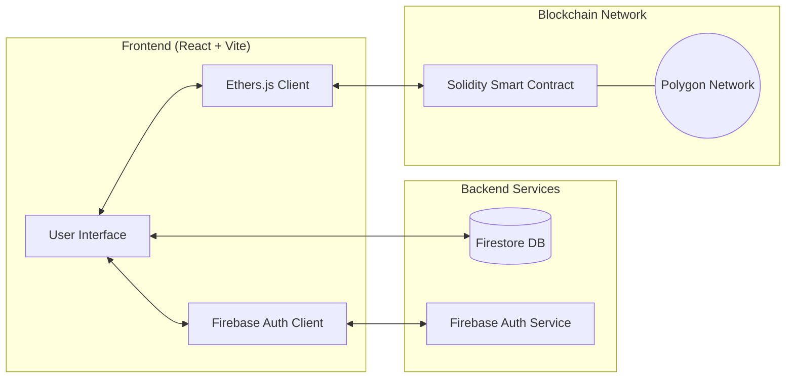

# MDM: The Future of Maritime Document Verification

## a. How different is it from any of the other existing ideas?

Traditional maritime document management relies heavily on paper-based systems or centralized digital databases. MDM differentiates itself through:

1. **Decentralized Verification**: Unlike traditional databases that can be hacked or altered by administrators, MDM uses the **Polygon Blockchain**. This makes the record of issuance permanent and tamper-proof.
2. **Zero-Knowledge Integrity**: The actual content of the documents isn't stored on the blockchain; only the cryptographic hash is. This preserves privacy while ensuring absolute data integrity.
3. **Cross-Border Trust**: Maritime documents need verification in different jurisdictions. A blockchain-backed record is globally accessible and trusted without needing direct access to a specific country's internal government database.
4. **Instant QR-Based Validation**: MDM integrates real-time QR scanning directly into the platform, allowing port authorities to verify documents in seconds using just a mobile device.

## b. How will it be able to solve the problem?

Maritime document forgery is a multi-billion dollar problem leading to safety risks and legal complications. MDM solves this by:

- **Eliminating Forgery**: Since the document's unique hash is registered on-chain, any tiny change to the document will produce a different hash, immediately flagging it as invalid.
- **Streamlining Port State Control**: Port officers can instantly verify credentials without waiting for manual confirmation from issuing authorities.
- **Reducing Administrative Overhead**: Automated issuance and digital storage reduce the need for physical shipping and manual filing of documents.

## 🛠 List of Features Offered

| Feature | Description |
| :--- | :--- |
| **Document Issuance** | Intuitive form for authorities to issue new maritime certificates. |
| **Blockchain Registration** | Automatic hashing and registration of documents on the Polygon network. |
| **QR Code Generation** | Unique QR codes generated for every document for easy scanning. |
| **Instant Verification Portal** | A public-facing portal where anyone can verify a document by scanning a QR code or entering a Hash ID. |
| **Mobile-Friendly Scanner** | Integrated camera access for mobile verification on the go. |
| **PDF Generation** | Professional PDF export for digital sharing and printing. |
| **Admin Dashboard** | Secure control center for issuing authorities (powered by Firebase Auth). |

## 🌟 Google Technologies Used

- **Firebase Authentication**: Provides secure and reliable sign-in for maritime authorities.
- **Firebase Firestore**: Scalable NoSQL database to store document metadata and issuance history.
- **Google Fonts (Inter, Outfit)**: Premium typography used for a professional and legible interface.
- **Google Chrome V8 Engine**: Powers the lightning-fast Vite development and build process.

## 📊 Process Flow Diagram

## 🏗 Architecture Diagram

## 📐 Wireframes / Mock Diagrams

The solution follows a sophisticated "Maritime Navy" design system.

- **Home Page**: Authoritative hero section with clear "Verify" and "Issue" paths.
- **Issuance Form**: Clean, step-by-step input for maritime credentials.
- **Scanner Interface**: Minimalist camera view with overlaid scanning guide.
- **Verification Result**: High-contrast "Verified" (Green) or "Unverified" (Red) cards with detailed audit trail.

---
*Created for the MDM Project.*
